<style>
.alert {
    position:relative;
    padding:.75rem 1.25rem;
    margin-bottom:1rem;
    border:1px solid transparent;
    order-radius:.25rem
}
.alert-primary {
    color:#073984;
    background-image:linear-gradient(180deg, #d6e6ff, #cfe2ff);
    border-color:#bbd6fe
}
.alert-warning {
	color: #856404;
	background-image: linear-gradient(180deg, #fff5d5, #fff3cd);
	border-color: #ffeeba
}
</style>
* Table of Contents
{:toc}

<div style="page-break-after: always;"></div>

## How To Use This Guide

This **Developer Guide** aims to get developers familiarised with the design and implementation of **CLIrcuit Assistant**. The following table indicates the symbols used to aid the understanding of the guide. This guide also assumes that the reader has basic understanding of *UML Diagrams*. [To access the **User Guide** instead, click here.](UserGuide.md)

| Symbol/Format | Meaning |
|:---------------:|:--------|
|:information_source:|An informational source.|
|:exclamation:|A warning.|
|**Bolded**|A keyword.|
|*Italicised*|Technical word.|
|[Hyperlinked](#)|Leads to the appropriate section.|
|`Code`|Text that appears on the CLI / in code.|

--------------------------------------------------------------------------------------------------------------------


## Setting up, getting started
Refer to the guide [*Setting up and getting started*](SettingUp.md).

--------------------------------------------------------------------------------------------------------------------

<div style="page-break-after: always;"></div>

## Design Architecture (Wira) <a name="design"></a>


<small><i>Figure 1</i></small>

The **Architecture Design** given above explains the high-level design of the App. Given below is a quick overview of each component.

**`Duke`** is the main class of the application, and handles the app launch, initializing the appropriate classes to be used.

The rest of the app consists of three components.

* [**`UI`**](#ui-component): The UI of the App.
* [**`Logic`**](#logic-component): The command executor.
* [**`Model`**](#model-component): Holds the data of the App in memory.

### UI component

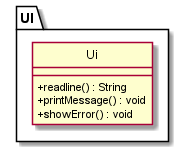

<small><i>Figure 2</i></small>

The `Ui` component

* Reads user input as lines using `readLine()`.
* Prints every `Command` object that is parsed using `printMessage()`.
* Prints any user input error that might occur using `showError()`.
* Does not depend on any of the other components.

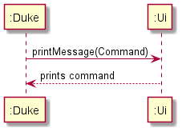

<small><i>Figure 3</i></small>

### Logic component

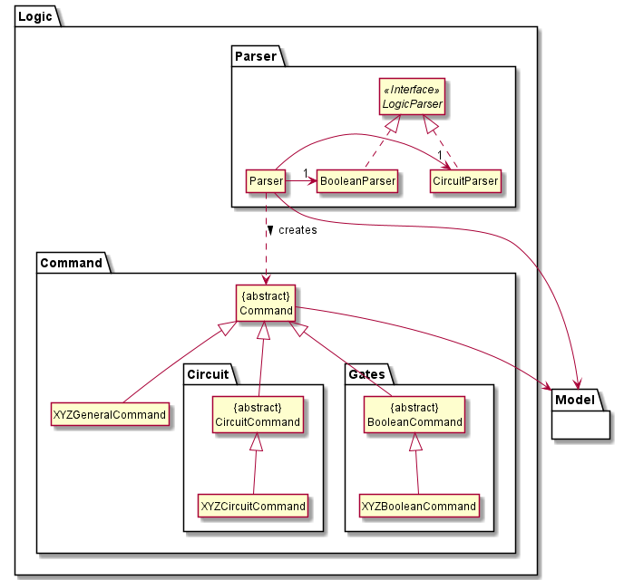

<small><i>Figure 4</i></small>

1. `Logic` stores a current `Template` object in [`Model`](#model-component) that represents the current circuit configuration.
1. `Logic` uses the `Parser` class to parse the user command.
1. This results in a `Command` object which is executed in `Duke`.
1. The command execution can affect the `Model` (e.g. setting a value).

<div style="page-break-after: always;"></div>

In general, the creation of `Command` objects via `Parser` can be explained by the following sequence diagram, which acts as a reference frame for `getCommand`:

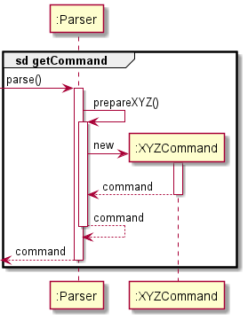

<small><i>Figure 5</i></small>

If the command does not use the reference frame, they would have their own sequence diagram to showcase the difference.

### Model component


<small><i>Figure 6</i></small>

The `Model`,
* includes `CircuitTemplate` and `BooleanTemplate` that can represent the current `template` in [`Logic`](#logic-component).
* has `Component` and `Gate` within the templates.
* does not depend on any of the other two components.

--------------------------------------------------------------------------------------------------------------------

<div style="page-break-after: always;"></div>

## Implementation of Circuit Commands (Dash) <a name="circ-comd"></a>

This section provides details on the implementation of the various electronic circuit commands.

There are 4 different types of components of electronic circuits that can be instantiated in the program:
* `Resistor` - A _resistor_ component.
* `Capacitor` - A _capacitor_ component.
* `Inductor` - An _inductor_ component.
* `VoltageSource` - An _Alternating Current_ Voltage Source.

Each component is used within a circuit template, based on the kind of circuit instantiated.

<div markdown="span" class="alert alert-primary">

:information_source: **Note:** The `VoltageSource` is instantiated in all Circuit Templates.

</div>

There are four different circuit templates that can be instantiated in the program:

* `LcTemplate` - Inductor-Capacitor Circuit Template
* `RTemplate` - Resistor Circuit Template
* `RcTemplate` - Resistor-Capacitor Template (extends `RTemplate`)
* `LrTemplate` - Inductor-Resistor Template (extends `RTemplate`)

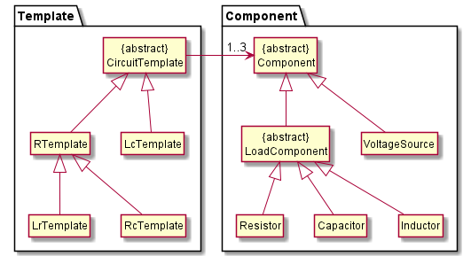

<small><i>Figure 7</i></small>

The diagram above showcases the relationships between the various `Component` and `Template` objects.

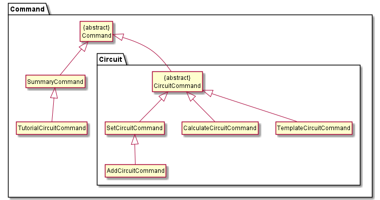

<small><i>Figure 8</i></small>

The diagram above demonstrates the relationship between the various `CircuitCommand` objects. The various commands to be parsed are as explained in this section. While the **User Guide** explains the commands used on the CLI, this section goes into detail the classes used to execute the commands. The command classes also make use of the classes in the [**`Model`**](#model-component) shown in the diagram below when executing the commands.

For commands excluding `TemplateCircuitCommand`, the following sequence diagram will showcase how the `getComponent` reference frame occurs:

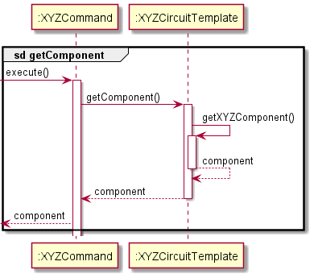

<small><i>Figure 9</i></small>

<div style="page-break-after: always;"></div>

### `TemplateCircuitCommand`  <a name="temp-circ"></a>
Given below is the sequence diagram for interactions within the `logic` and `template` components for the 
`parse(template rl)` API call that implements the `template` command to create templates.

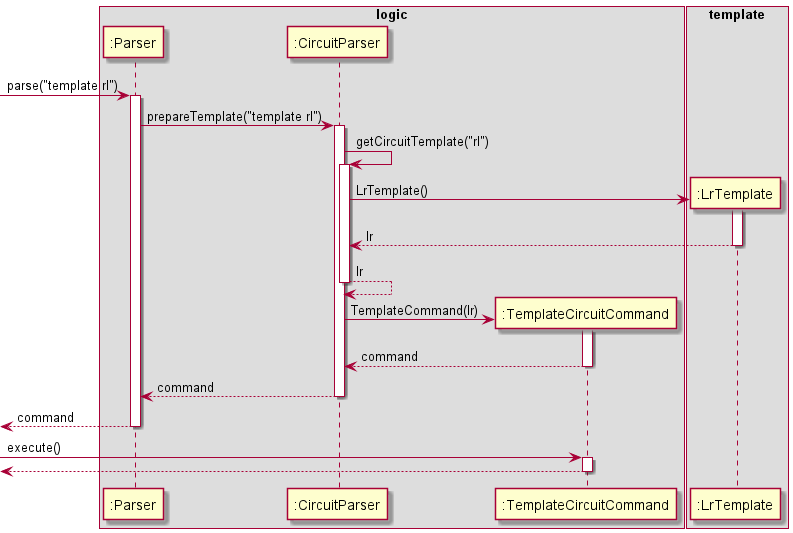

<small><i>Figure 10</i></small>

<div style="page-break-after: always;"></div>

### `SetCircuitCommand` <a name="set-circ"></a>

Given below is the Sequence Diagram for interactions within the `Logic` component for the `parse("set r 500")` API call which implements the `set` command to set values of components.

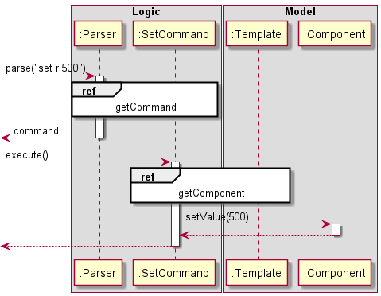

<small><i>Figure 11</i></small>  

<div style="page-break-after: always;"></div>

### `AddCircuitCommand` <a name="add-circ"></a>

Given below is the detailed Sequence diagram for interactions within the `logic`, `template` and `component` components 
for the `parse("add parallel c 20")` API call that implements the `add` command to add components.


<small><i>Figure 12</i></small>  

<div style="page-break-after: always;"></div>

### `CalculateCircuitCommand` <a name="calc-circ"></a>
The calculate command can be split into two distinct sequence diagrams. Given below is the sequence diagram for the
calculate command that does not show the access of the `component` component and shows the interactions for the
`parse("calc power")` API call that implements this version of the `calculate` command to calculate power.  


<small><i>Figure 13</i></small>  

<div style="page-break-after: always;"></div>

The second sequence diagram given below shows the detailed interaction that accesses the `component` class through the
`parse("calc reff")` API call that implements this version of the `calculate` command to calculate effective resistance.


<small><i>Figure 14</i></small>  

### Implementation Considerations For Circuit Commands (Dash) <a name="impl-cons-dash"></a>
This section describes the methods taken into consideration while implementing the Circuit Commands.

#### Rationale Behind The Implementation of Circuit Template <a name="rationale-circuit-dash"></a>
This section details the rationale for implimenting the circuit template as described in the prior sections. Selecting a way to build circuits is the primary purpose of the system and hence a way to design the circuit is required. Since the system is designed primarily as a command line interface, creating complex customizable circuits using a graphical interface is beyond the scope of this system. To implement a circuit four different `template` classes are used, which inherit from a superclass `template`. The four different templates are also presented as simple logos to show how the templates would look like as real life circuits. Furthermore, the function to add components to the circuit calculates the effective value with the components that are already present. For example when a resistor is added in parallel, the effective resistance of the aforementioned resistor is added to the effective resistance of the resistor already present in the circuit template. The two resistors are then replaced by one resistor with the same effective resistance. Similarly, other components are also added and abstracted into a single component of the matching component type.

#### Alternatives Considered <a name="alt-circuit-dash"></a>
This section illustrates the alternatives considered for implementing the Circuit Template.

* Linked List: A linked list implementation involves using each circuit component as a node and the connections between 
the nodes as wires. The head of the linked list is the voltage source and the a loop is present from the tail node 
number 2 (i.e index 1). However, such an approach does not allow users to simulate the circuit effectively so this 
approach is not followed. The circuit templates on the other hand not only allow the user to distinguish between 
different types of circuits but they also provide an efficient way of storing the various parameters related to a circuit.

* Adjacency Matrix: The Adjacency matrix representation of a graph data structure is also considered as it allows connections between nodes.
 Each node is a component and a matrix is derived where a 1 represents a connection between the row of that element and
 the column of the same element. This approach is rejected due to high space complexity. For example, adding a component
 to the matrix requires O(V^2) time complexity where V is the number of vertices. Similarly, removing a component from 
 the matrix also requires the same time complexity. On the other hand, the chosen implementation only requires O(1) 
 time complexity for the same functions, leading to a more efficient and faster system. Furthermore, issues with space
 complexity also hinder the use of an adjacency matrix to represent circuit templates.

--------------------------------------------------------------------------------------------------------------------


<div style="page-break-after: always;"></div>

## Implementation of Boolean Commands (Praveen) <a name="bool-comd"></a>


<small><i>Figure 15</i></small>

The second major feature of the application is the implementation of Boolean logic commands, of which various noteworthy implementation details are explained in this section. The above diagram demonstrates the relationships between the various `Command` objects. Notice the similarities to the [Circuit Commands in the earlier section](#implementation-of-circuit-commands-dash-).

There are six different logic gates that can be instantiated in the program, which can be seen in the diagram below:

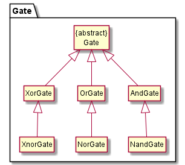

<small><i>Figure 16</i></small>

<div style="page-break-after: always;"></div>

The next diagram then showcases the methods involved in the `BooleanTemplate` and `Gate` classes to work together:

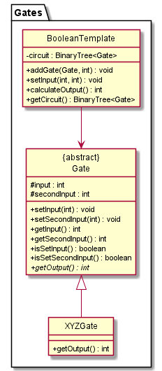

<small><i>Figure 17</i></small>

All gates can be first instantiated using the `Gate` class which has one `int input` and one `int output` as its attributes. 
It has `setInput(int input)` and `getOutput()` as its methods, which are used to set the input of the logic gate and get the output of the gate respectively. 

The six different logic gates take in two different inputs, which necessitates the need for a logic gate class to take in one more input.
This can be achieved by instantiating the `TwoInputGate` class which inherits from the `Gate` class. It has an additional attribute `int secondInput`
to take in the additional input and a method `setSecondInput(int input)` to set the Boolean value of either `0 or 1` to the additional input.

The six different logic gates then individually inherit from the `TwoInputGate` class where the return value of their `getOutput()` function depends
on the logic function of the gate itself. For instance, the `OrGate` which inherits from the `TwoInputGate` class has its `getOutput()` function set to `{return input | secondInput}`, 
which represents the `or` operation.

An instance of an `OrGate` can be visualised as such in the following object diagram:


<small><i>Figure 18</i></small>

<div style="page-break-after: always;"></div>

### `TemplateBooleanCommand` <a name="temp-bool"></a>

The `TemplateBooleanCommand` creates a Boolean template of any one of the six available logic gates. 

The sequence by which the `TemplateBooleanCommand` is instantiated is as follows using the user input `template and` who wants to instantiate an `and` logic template.

1. The `Parser` object takes in a String that specifies the template type: in this case, it is an `and` Boolean template.
2. The `and` Boolean template is then prepared through the `BooleanParser` object.
3. The `and` Boolean template is instantiated using the `TemplateBooleanCommand`.

The aforementioned sequence of events can be represented in the following sequence diagram:

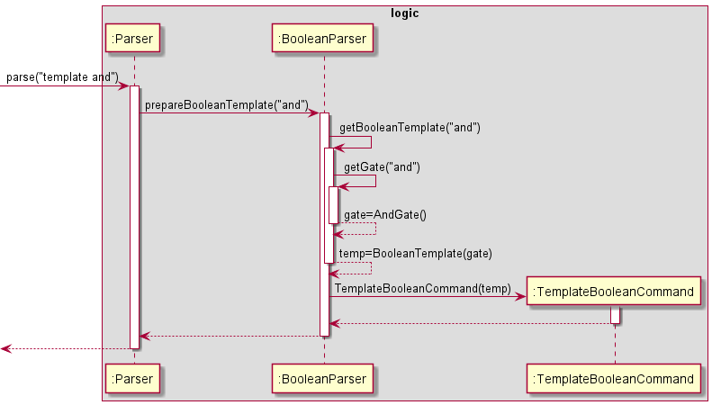

<small><i>Figure 19</i></small>

<div style="page-break-after: always;"></div>

### `SetBooleanCommand` <a name="set-bool"></a>

The sequence of object interactions through the `SetBooleanCommand` can be represented in the following sequence diagram:


<small><i>Figure 20</i></small>

<div style="page-break-after: always;"></div>

### `AddBooleanCommand` <a name="add-bool"></a>

The `AddBooleanCommand` is used to combine multiple logic gate templates to produce advanced Boolean logic gate configurations.
For instance, an `OrGate` can be combined with an `AndGate` to produce a new logic configuration where its final output will depend on the
Boolean values assigned to the `OrGate` and `AndGate`. This gate configuration can undergo further addition operations by `AddBooleanCommand` to 
combine another logic gate, such as `XorGate`. 

The sequence by which the `AddBooleanCommand` is instantiated to combine the logic gates is as follows:

1. The `AddBooleanCommand` object calls on the `addGate` method in the instantiated `BooleanTemplate`.
2. This will access the index of the `BinaryTree` object in the `BooleanTemplate` to store the newly added gate to the configuration.

<div style="page-break-after: always;"></div>

The aforementioned sequence of events can be represented in the following sequence diagram:


<small><i>Figure 21</i></small>

### `CalculateBooleanCommand` <a name="calc-bool"></a>

The `CalculateBooleanCommand` is used to calculate the effective output of the configured logic gates stored in the `BinaryTree`, which requires that all inputs be set.

For instance, in a `BinaryTree` object with just two gates - `OrGate` and `AndGate` - all the inputs of the gates have to be assigned before the effective output of both the logic gates (`Input C`) can 
be calculated.

The sequence by which the `CalcBooleanCommand` is instantiated is as follows:


<small><i>Figure 22</i></small>

<div style="page-break-after: always;"></div>

The `checkIndex` and `setIndex` reference frames are also shown below. Note that `setIndex` possibly contains recursive `calculateOutput()` calls.

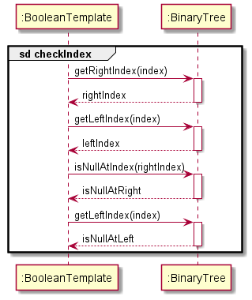

<small><i>Figure 23 (Wira)</i></small>


<small><i>Figure 24 (Wira)</i></small>

<div style="page-break-after: always;"></div>

### Implementation Considerations For Boolean Commands (Vishruti) <a name = "impl-cons"></a>
This section describes the methods taken into consideration whilst implementing the Boolean Commands.

#### Rationale Behind Using Binary Heap-Like Data Structure <a name="rationale-bool"></a>
Selecting the appropriate data structure for emulating a logic circuit is an important aspect to consider whilst
building such a system. The following table depicts the properties of a Binary Heap-Like structure mapped to the 
application's requirements.

| Requirements | Property of Binary Heap |
|:----------:|:-------------:|
| Connects different gates together | A binary-heap, being a type of binary tree, is a _connected graph_. |
| Easily stored | Can be stored in simple contiguous memory like an Array/ArrayList |
| Easy to print | Nodes stored in an array, rather than a graph-like structure |
| Inputs can be easily manipulated | Manipulating augmented values involves a simple _O(1)_ operation. |
| Emulate 2-input logic circuit | Being a binary tree, each node can have atmost 2 children, thus recreating a 2-Input Logic Gate |

Therefore, since the Binary Heap-Like data structure best-fit the requirements for the system, the data structure was selected to
implement a Logic Circuit,

#### Alternatives Considered
The preceding section detailed on the rationale behind choosing the data structure used to emulate the Logic Circuit. 
This section details on the alternative mechanisms considered for the system and why they would not be viable:

* Simple Binary Tree: In essence, a Binary-Heap is a special kind of Binary Tree. However, it is not efficient to store
a Binary Tree in a contiguous memory location such as an Array/ArrayList. Thereby,
    1. Increasing complexity of storage.
    2. Increasing difficulty of manipulating circuit at certain position.

* Graph With Depth First Search: Using a graph means dealing with a more complex structure due to the lack of
restrictions on the number of child-nodes a node can have. Thereby,
    1. Extra considerations/checks for emulating 2-input logic circuit.
    2. Extra checks to test if graph is connected and circuit is complete.

Due to the limitations mentioned above, the Binary Heap-Like data structure was considerd to be the best method of approach.

<div style="page-break-after: always;"></div>

### Binary Tree
The previous section described the rationale behind using a special Binary Tree-like structure (Heap) for implementing the
Boolean Commands. This section provides details on *how* the logic circuit is modeled using the selected data structure. 

The Boolean `add`, `set` and `calculate` features are modeled using a generic `BinaryTree<T>` class. The `BooleanTemplate` imports this class to store and evaluate the logic circuit. 

The elements of the tree are stored in a fixed `ArrayList` (size = 15) indexed in a _heap-like_ manner. That is, a left to right _level-order traversal_ will map to the indexes of the array. The following diagram represents the indexes each node in the tree corresponds to in the `ArrayList`.
```
                  [0]
                   |     
       [1]                    [2]
                     
  [3]       [4]         [5]         [6]
                      
[7] [8]   [9] [10]   [11] [12]   [13] [14]
```
The operations exposed to the `Logic` in this `Model` include: 
* `BinaryTree#isNullAtIndex(int)` - Checks whether the value at specified index in tree is `null` or not.
* `BinaryTree#getParentIndex(int)` - Returns index of parent node.
* `BinaryTree#insert(int, T)` - Inserts value at position specified in the tree, if valid.
* `BinaryTree#isLeaf(int)` - Returns Boolean based on whether node at specified index is a _leaf node_ or not.
* `BinaryTree#isEmpty()` - Checks if the tree has no elements in it.

When an object of the `BinaryTree<T>` class is created, it initialises the `ArrayList<T>` instance to 15 `null` values. This will be further discussed in the section detailing the `insert()` function.

<div style="page-break-after: always;"></div>

#### Initialising A `BinaryTree<T>` Object
The `Logic` initialises the `BinaryTree<Gate>` object using the parameterised constructor, thus specifying the `Gate` class type root. The object diagram below depicts the initial state of the `Model` when a `BinaryTree<Gate>` object is created.


<small><i>Figure 25</i></small>

The Logic uses the parameterised constructor of `BinaryTree<T>` to create the object since it requires initialisation of
the root. Such an object is created as follows: `BinaryTree<Gate> obj = new BinaryTree(new OrGate(1,1))`. This sets the root of the Binary Tree to the object specified.

#### Using `BinaryTree#isNullAtIndex(int)`
`BooleanTemplate` uses this function to render the current configuration of the circuit in a String format. The method
is also extensively used in other internal operations in `BinaryTree<T>` for checking whether a position in the tree has been set or not.

#### Using `BinaryTree#getParentIndex(int, T)`
Similar to `isNullAtIndex(int)`, this method is used in rendering the current configuration of the circuit in String format.

<div style="page-break-after: always;"></div>

#### Using `BinaryTree#insert(int, T)`
In order to enable the ability to populate the `ArrayList<T>` at any node which has a non-null parent node
the `ArrayList<T> arrayList` attribute is pre-populated with 15 `null` values. The same attribute is modified in the insert()
operation in the list. Since `insert(int, T)` makes use of `ArrayList<T>.set(int, T)`, values in `arrayList` can be overwritten with this function.

The following sequence diagram is a depiction of the events succeeding a call to `insert(1, new AndGate(1,1))`. 


<small><i>Figure 26</i></small>

Post calling this function, the second element in the `arrayList` will be the `AndGate(1,1)` object.

<div style="page-break-after: always;"></div>

#### Using `BinaryTree#isLeaf(int)`
This function is used by the Logic class `BooleanTemplate` to calculate output values in the digital circuit. It 
returns whether the node at the input index is a leaf node or not.

The following sequence diagram is a depiction of the events succeeding a call to `isLeaf(1)`on the current `arrayList`:


<small><i>Figure 27</i></small>

#### Using `BinaryTree#isEmpty`
This is used by `BooleanTemplate` to ensure no calculations are being performed on an empty tree.

The following sequence diagram showcases the events succeeding a call to `isEmpty()` on the current object of the `BinaryTree<Gate>` 


<small><i>Figure 28</i></small>
 
<div style="page-break-after: always;"></div>

### Rendering Current Boolean Circuit State
Using a _standard I/O operation_ (Like _Sopln()_) on an object of the `BooleanTemplate` class yields the current configuration
of the system.
Each node of the system is represented by a signal ranging from B to O (OUT being the root). All nodes with `null` parent nodes are
not shown in the diagram. The following diagram depicts a tree wherein no parent nodes are `null`:
```
              0UT
               |     
      B                  C
                     
  D       E         F         G
                      
H  I     J  K      L  M      N  O
```

--------------------------------------------------------------------------------------------------------------------

<div style="page-break-after: always;"></div>

## Appendix: Requirements (Dorian)

This section details the various requirements that the project needs to fulfil.

### Product scope

#### Target user profile
  

New Computer/Electrical Engineering (CEG/EE) students who are looking for a quick way to check calculations for simple circuit configurations can use this App as an aid.

#### Value proposition

**CLIrcuit Assistant** solves three problems:

1. Lack of access to simple circuit computation - the App quickly computes the required circuit's values.
1. Doing labs at home because of remote learning - the App provides a quick visualisation tool for the student.
1. Online alternatives require internet access, and some sites are slow to load with many resources needed - the App is an offline desktop application with minimal resources.

### User Stories (Wira)

|Version| As a ... | I want to ... | So that I can ...|
|--------|----------|---------------|------------------|
|v1.0|new CEG/EE Student |solve electronic/logic circuits through an Interactive Tutorial|get used to using a command line whilst simultaneously learning about circuits and apply the concepts in modules such as CG1111|
|v1.0|new CEG/EE Student|create template circuits using common components such as Resistors, Capacitors, Inductors|visualise and calculate values for common circuit configurations |
|v1.0|new CEG/EE Student | change values assigned to the components| obtain different calculations quickly|
|v1.0|new CEG/EE Student|add components arranged in either series or parallel|obtain my configuration for analysis|
|v1.0|new CEG/EE Student |calculate/verify my calculations of effective resistance, total capacitance, etc.|quickly and accurately do so via CLI, and not 3rd party software that I have to install/load online|
|v2.0|CEG/EE Student|compute a Boolean logical expression|familiarise myself with logical computation used in digital circuits|
|v2.0|CEG/EE Student|create a template Boolean logic gate to connect more gates to|build a logical circuit|
|v2.0|CEG/EE Student|add logic gates to configure a Boolean logic circuit|create my own configuration of logic gates
|v2.0|CEG/EE Student|set input values to the logic gate configuration|analyse inputs and outputs of a configuration
|v3.0|CEG/EE Student|print the current template I am working on|find out my current configuration and make a decision

### Storage (Wira)

While many other applications under CS2113 implement a storage feature, our app does not include one in the current implementation at v2.1 with the following rationale:

* The focus is on the representation of template circuits and how the users would interact with them. Obtaining the circuit configuration from the user's side is an easy process and therefore it would not be necessary for a user to store the circuits for future reference.
* The application is, in a sense, equivalent to a calculator. It aims to assist the user in performing quick circuit calculations.
* [Constraints involved](https://nus-cs2113-ay2021s1.github.io/website/admin/tp-constraints.html) include requiring the storage file to be human editable. Since there is no data file to break the constraint, the constraint is fulfiled.

It is perhaps possible for a future iteration (v3.0 onwards) to implement the feature, but it was not considered an important feature according to our **User Stories**.

### Non-Functional Requirements (Dorian)

1. Should work on any *mainstream OS* as long as it has Java 11 or above installed.
2. The average user profile is assumed to be someone who possesses *at least a basic understanding of the fundamental concepts of digital circuits, its components, and Boolean logic computation* (concepts covered in CG1111, CS1231 and EE2026).
3. A user with above average typing speed for regular English text (i.e. not code, not system admin commands) should be able to accomplish most of the tasks faster using commands than using the mouse.

--------------------------------------------------------------------------------------------------------------------

<div style="page-break-after: always;"></div>

## Glossary (Vishruti)

The terms listed in this glossary are in alphabetical order.

Term | Explanation
-|-
 *Alternating Current* | Alternating current (AC) is an electric current which periodically reverses direction and changes its magnitude continuously with time.
 *AND* | Also known as conjunction, AND is a basic operation in boolean algebra which may be denoted as x AND y. <br>The truth value of the operation will result in 1 (TRUE) if both x == 1 and y == 1, and 0 for other combinations of values. 
 *Average Typing Speed* | An average typing speed is [40 words per minute](https://www.livechat.com/typing-speed-test/#/).
 *Binary Tree* | A data structure wherein each node has maximum 2 child nodes, which are called the left and right node.
 *Capacitor* | A passive electronic device with 2 terminals that stores electrical energy in an electric field.
 *CG1111* | Engineering Principles and Practices I, a core module generally taken by Year 1 Computer Engineering students at NUS.
 *Connected Graph* | A graph in which it is possible to get to every node in the graph through a series of edges.
 *CS1231* | Discrete Mathematics, a core module generally taken by Year 1 School of Computing students at NUS.
 *Digital Circuits* | A circuit wherein the signal must be one of 2 discrete logic levels - 1 or 0.
 *EE2026* | Digital Design, a core module generally taken by Year 1 students in Electrical and Computer Engineering at NUS.
 *Graph* | A data structure which consists of a finite set of nodes and a finite set of edges connecting them.
 *Heap* | A tree based data structure where all the nodes are stored in a certain order.
 *Inductor* | A passive electronic device with 2 terminals that stores electrical energy in a magnetic field.
 *Leaf Node* | A node in a binary tree data structure whose left and right children are null.
 *Level Order Traversal* | A method of processing all nodes in a tree data structure by depth (level-by-level).
 *Logic Gate* | A virtual/physical electronic device which performs a boolean function. Usually has 2 inputs and 1 output.
 *Mainstream OS* | For example Microsoft Windows, macOS, Unix, Linux etc.
 *NAND* | An inverse of the AND operation. Outputs are the opposite of what an AND gate would output for a set of input values.
 *Node* | A binary tree is made up of nodes, each which have a left and right reference, as well as hold data.
 *NOR* | An inverse of the OR operation. Outputs the opposite truth value of what an OR gate would output. 
 *O(1)* | An algorithm or a computational operation that is said to take constant time, irrespective of the size of input.
 *OR* | Also known as disjunction, OR is a basic operation in boolean algebra which may be denoted as x OR y. <br> The truth value of the operation will result in 1 (TRUE) if either x == 1 or y == 1, and 0 if both x and y are 0. 
 *Parent Node* | A node in a binary tree data structure which has one or more child nodes.
 *Resistor* | A passive electronic device which implements electrical resistance in an electronic circuit.
 *Sopln()* | Abbreviation for java out operation "`System.out.println()`", from package `java.lang`.
 *Standard I/O Operation* | Common java I/O streams include `System.in`, `System.out` and `System.err`.
 *XNOR* | An inverse of the XOR operation. Outputs the opposite truth value of what a XOR gate would output.
 *XOR* | Also known as exclusive OR, XOR is a secondary operation in boolean algebra which may be denoted as x XOR y. <br> The truth value of the operation will result in 1 (TRUE) if only one of x == 1 or y == 1, and 0  for other combinations of values.

 -------------------------------------------------------------------------------------------------------------------- 


## Appendix: Instructions for manual testing (Dorian)
### Initial launch  
1. Download the jar file and copy it into an empty folder
2. Open a new terminal window and navigate to the same directory where your duke.jar is located
3. Enter the command `java -jar duke.jar` into the terminal window to launch the application
4. Enter `tutorial circuit` or `tutorial boolean` to go through an [interactive tutorial](UserGuide.md/#52-interactive-tutorial) or `summary` to generate a summary of all the commands

### Creating a digital circuit  
1. Enter `template` followed by the template type, e.g.: `template rc`
There are four templates to choose from: `r`,`rc`,`rl`,`lc`. 
2. Enter `set` followed by the component type to set the component value, e.g.: `set r 500`
The four types of components are: `r`,`c`,`l`,`v`. Note that the value inputted can be an integer or float
3. Enter `add` followed by the configuration, component , and component value to add a component e.g.:`add parallel c 500`

### Creating a logic gate 
Similar to the creation of a digital circuit, we create a `template`, `set` values, and can `add` values.

For the detailed steps, visit [Boolean Action Commands](https://ay2021s1-cs2113t-w13-3.github.io/tp/UserGuide.html#7-boolean-action-commands).

### Calculating values
For calculation of values, the `calc` command is used.

The following links provide detailed steps for calculations for the respective section:

* [Circuits](https://ay2021s1-cs2113t-w13-3.github.io/tp/UserGuide.html#64-calculating-effective-value-)

* [Boolean](https://ay2021s1-cs2113t-w13-3.github.io/tp/UserGuide.html#74-calculating-output-) 

### Exiting the program
Simply enter `bye` to exit the program and bid farewell to your loyal **CLIrcuit Assistant**.
