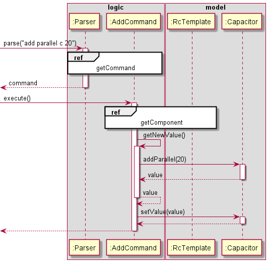
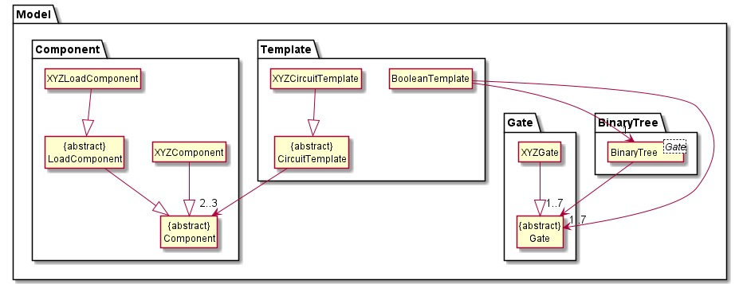

# Developer Guide

## Table of Contents
* [Design & Implementation](#design--implementation)
    * [UI component](#ui-component)
    * [Logic component](#logic-component)
    * [Model component](#model-component)
* [Product scope](#product-scope)
    * [Target user profile](#target-user-profile)
    * [Value proposition](#value-proposition)
* [User Stories](#user-stories)
* [Non-Functional Requirements](#non-functional-requirements)
* [Glossary](#glossary)
* [Instructions for manual testing](#instructions)

## Design & Implementation

The **Architecture Design** given above explains the high-level design of the App. Given below is a quick overview of each component.

**`Duke`** is the main class of the application, and handles the app launch, initializing the appropriate classes to be used.

The rest of the app consists of four components.

* [**`UI`**](#ui-component): The UI of the App.
* [**`Logic`**](#logic-component): The command executor.
* [**`Model`**](#model-component): Holds the data of the App in memory.

### UI component

The `Ui` component

* Executes user commands using the `Logic` component.
* Listens for changes to `Model` data so that the UI can be updated with the modified data.

### Logic component

1. `Logic` stores a current `Template` object that represents the current circuit configuration.
1. `Logic` uses the `Parser` class to parse the user command.
1. This results in a `Command` object which is executed in `Duke`.
1. The command execution can affect the `Model` (e.g. setting a value).
1. In addition, the `Ui` may also perform certain actions, such as displaying help to the user.

The various command classes to be parsed can be divided into Trivial and Non-Trivial classes:
##### - Trivial Classes

##### - Non-Trivial Classes
`SetCommand`  
Given below is the Sequence Diagram for interactions within the `Logic` component for the `parse("set r 500")` API call
which implements the set command to set values of components.

  

`AddCommand`    
Given below is the detailed Sequence diagram for interactions within the `logic`, `template` and `component` components 
for the `parse("add parallel c 20")` API call that implements the add command to add components.

  

`CalculateCommand`  
The calculate command can be split into two distinct sequence diagrams. Given below is the sequence diagram for the
calculate command that does not show the access of the `component` component and shows the interactions for the
`parse("calc power")` API call that implements this version of the calculate command to calculate power.  

  

The second sequence diagram given below shows the detailed interaction that acesses the `component` class through the
`parse("calc reff")`API call that implements this version of the calculate command to calculate effective resistance.

  

`TemplateCommand`  
Given below is the sequence diagram for interactions within the `logic` and `template` components for the 
`parse(template rl)` API call that implements the template command to create templates.

 

### Model component

The `Model`,
* includes `CircuitTemplate` and `BooleanTemplate` that can represent the current `template` in [`Logic`](#logic-component).
* has `Component` and `Gate` within the templates.
* does not depend on any of the other three components.

## Product scope
### Target user profile

New Computer/Electrical Engineering (CEG/EE) students who are looking for a quick way to check calculations for simple circuit configurations can use this App as an aid.

### Value proposition

CLIrcuit Assistant solves three problems:

1. Lack of access to simple circuit computation - the App quickly computes the required circuit's values.
1. Doing labs at home because of remote learning - the App provides a quick visualisation tool for the student.
1. Online alternatives require internet access, and some sites are slow to load with many resources needed - the App is an offline desktop application with minimal resources.

## User Stories

|Version| As a ... | I want to ... | So that I can ...|
|--------|----------|---------------|------------------|
|v1.0|new CEG/EE Student |solve electronic/logic circuits through an Interactive Tutorial|get used to using a command line whilst simultaneously learning about circuits and apply the concepts in modules such as CG1111|
|v1.0|new CEG/EE Student|create template circuits using common components such as Resistors, Capacitors, Inductors|visualise and calculate values for common circuit configurations |
|v1.0|new CEG/EE Student | change values assigned to the components| obtain different calculations quickly|
|v1.0|new CEG/EE Student|add components arranged in either series or parallel|obtain my configuration for analysis|
|v1.0|new CEG/EE Student |calculate/verify my calculations of effective resistance, total capacitance, etc.|quickly and accurately do so via CLI, and not 3rd party software that I have to install/load online|
|v2.0|CEG/EE Student|compute a boolean logical expression|familiarise myself with logical computation used in digital circuits|

## Non-Functional Requirements

{Give non-functional requirements}

## Glossary

* *glossary item* - Definition

## Instructions for manual testing 

{Give instructions on how to do a manual product testing e.g., how to load sample data to be used for testing}
