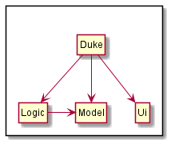
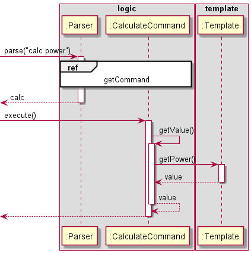
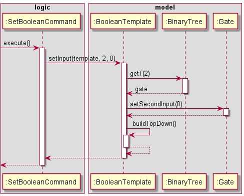
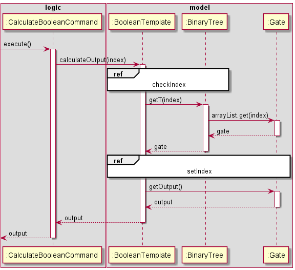

# Developer Guide

This **Developer Guide** aims to get developers familiarised with the design and implementation of **CLIrcuit Assistant**. The following table indicates the symbols used to aid the understanding of the guide. This guide also assumes that the reader has basic understanding of *UML Diagrams*. [To access the **User Guide** instead, click here.](#UserGuide.md)

| Symbol/Format | Meaning |
|:---------------:|:--------|
|:information_source:|An informational source.|
|:exclamation:|A warning.|
|**Bolded**|A keyword.|
|*Italicised*|Technical word.|
|[Hyperlinked](#)|Leads to the appropriate section.|
|`Code`|Text that appears on the CLI / in code.|

## Table of Contents
* [Setting up, getting started](#setting-up-getting-started)
* [Design Architecture](#design)
    * [UI component](#ui-component)
    * [Logic component](#logic-component)
    * [Model component](#model-component)
* [Implementation of Circuit Commands](#circ-comd)
    * [Creating Template](#temp-circ)
    * [Setting Component](#set-circ)
    * [Adding Component](#add-circ)
    * [Calculating Value](#calc-circ)
* [Implementation of Boolean Commands](#bool-comd)
    * [Binary Tree](#binary-tree)
        * [Initialising A BinaryTree Object](#initialising-a-binarytreet-object)
        * [Using BinaryTree isNullAtIndex(int)](#using-binarytreeisnullatindexint)
        * [Using BinaryTree getParentIndex(int)](#using-binarytreegetparentindexint-t)
        * [Using BinaryTree insert(int, T)](#using-binarytreeinsertint-t)
        * [Using BinaryTree isLeaf(int)](#using-binarytreeisleafint)
        * [Using BinaryTree isEmpty()](#using-binarytreeisempty)
    * [Rendering Current Boolean Circuit State](#rendering-current-Boolean-circuit-state)
* [Appendix: Requirements](#appendix-requirements)
    * [Product scope](#product-scope)
    * [User Stories](#user-stories)
    * [Non-Functional Requirements](#non-functional-requirements)
    * [Glossary](#glossary)
* [Appendix: Instructions for manual testing](#appendix-instructions-for-manual-testing)
    * [Initial launch](#initial-launch)
    * [Creating a digital circuit](#creating-a-digital-circuit)
    * [Creating a logic gate](#creating-a-logic-gate)
    * [Calculating values](#calculating-values)
    * [Exiting the program](#exiting-the-program)
    

## Setting up, getting started
Refer to the guide [*Setting up and getting started*](SettingUp.md).

## Design Architecture <a name="design"></a>



The **Architecture Design** given above explains the high-level design of the App. Given below is a quick overview of each component.

**`Duke`** is the main class of the application, and handles the app launch, initializing the appropriate classes to be used.

The rest of the app consists of three components.

* [**`UI`**](#ui-component): The UI of the App.
* [**`Logic`**](#logic-component): The command executor.
* [**`Model`**](#model-component): Holds the data of the App in memory.

### UI component


The `Ui` component

* Reads user input as lines using `readLine()`.
* Prints every `Command` object that is parsed using `printMessage()`.
* Prints any user input error that might occur using `showError()`.


### Logic component


1. `Logic` stores a current `Template` object in [`Model`](#model-component) that represents the current circuit configuration.
1. `Logic` uses the `Parser` class to parse the user command.
1. This results in a `Command` object which is executed in `Duke`.
1. The command execution can affect the `Model` (e.g. setting a value).
1. In addition, the `Ui` may also perform certain actions, such as displaying help to the user.

### Model component


The `Model`,
* includes `CircuitTemplate` and `BooleanTemplate` that can represent the current `template` in [`Logic`](#logic-component).
* has `Component` and `Gate` within the templates.
* does not depend on any of the other three components.

## Implementation of Circuit Commands <a name="circ-comd"></a>


The diagram above demonstrates the relationship between the various `CircuitCommand` objects. The various commands to be parsed are as explained in this section. While the **User Guide** explains the commands used on the CLI, this section goes into detail the classes used to execute the commands.

### `TemplateCircuitCommand`  <a name="temp-circ"></a>
Given below is the sequence diagram for interactions within the `logic` and `template` components for the 
`parse(template rl)` API call that implements the `template` command to create templates.


### `SetCircuitCommand` <a name="set-circ"></a>

Given below is the Sequence Diagram for interactions within the `Logic` component for the `parse("set r 500")` API call which implements the `set` command to set values of components.

  

### `AddCircuitCommand` <a name="add-circ"></a>

Given below is the detailed Sequence diagram for interactions within the `logic`, `template` and `component` components 
for the `parse("add parallel c 20")` API call that implements the `add` command to add components.

  

### `CalculateCircuitCommand` <a name="calc-circ"></a>
The calculate command can be split into two distinct sequence diagrams. Given below is the sequence diagram for the
calculate command that does not show the access of the `component` component and shows the interactions for the
`parse("calc power")` API call that implements this version of the `calculate` command to calculate power.  

  

The second sequence diagram given below shows the detailed interaction that acesses the `component` class through the
`parse("calc reff")` API call that implements this version of the `calculate` command to calculate effective resistance.

  

## Implementation of Boolean Commands <a name="bool-comd"></a>

The second major feature of the application is the implementation of Boolean logic commands, of which various noteworthy implementation details are explained in this section.

### Binary Tree
The Boolean `add`, `set` and `calculate` features are modeled using a generic `BinaryTree<T>` class. The `BooleanTemplate` imports this class to store and evaluate the logic circuit. 

The elements of the tree are stored in a fixed `ArrayList` (size = 15) indexed in a _heap-like_ manner. That is, a left to right _level-order traversal_ will map to the indexes of the array. The following diagram represents the indexes each node in the tree corresponds to in the `ArrayList`.
```
                  [0]
                   |     
       [1]                    [2]
                     
  [3]       [4]         [5]         [6]
                      
[7] [8]   [9] [10]   [11] [12]   [13] [14]
```
The operations exposed to the `Logic` in this `Model` include: 
* `BinaryTree#isNullAtIndex(int)` - Checks whether the value at specified index in tree is `null` or not.
* `BinaryTree#getParentIndex(int)` - Returns index of parent node.
* `BinaryTree#insert(int, T)` - Inserts value at position specified in the tree, if valid.
* `BinaryTree#isLeaf(int)` - Returns Boolean based on whether node at specified index is a _leaf node_ or not.
* `BinaryTree#isEmpty()` - Checks if the tree has no elements in it.

When an object of the `BinaryTree<T>` class is created, it initialises the `ArrayList<T>` instance to 15 `null` values. This will be further discussed in the section detailing the `insert()` function.

#### Initialising A `BinaryTree<T>` Object
The `Logic` initialises the `BinaryTree<Gate>` object using the parameterised constructor, thus specifying the `Gate` class type root. The object diagram below depicts the initial state of the `Model` when a `BinaryTree<Gate>` object is created.


The Logic uses the parameterised constructor of `BinaryTree<T>` to create the object since it requires initialisation of
the root. Such an object is created as follows: `BinaryTree<Gate> obj = new BinaryTree(new OrGate(1,1))`. This sets the root of the Binary Tree to the object specified.

#### Using `BinaryTree#isNullAtIndex(int)`
`BooleanTemplate` uses this function to render the current configuration of the circuit in a String format. The method
is also extensively used in other internal operations in `BinaryTree<T>` for checking whether a position in the tree has been set or not.

#### Using `BinaryTree#getParentIndex(int, T)`
Similar to `isNullAtIndex(int)`, this method is used in rendering the current configuration of the circuit in String format.

#### Using `BinaryTree#insert(int, T)`
In order to enable the ability to populate the `ArrayList<T>` at any node which has a non-null parent node
the `ArrayList<T> arrayList` attribute is pre-populated with 15 `null` values. The same attribute is modified in the insert()
operation in the list. Since `insert(int, T)` makes use of `ArrayList<T>.set(int, T)`, values in `arrayList` can be overwritten with this function.

The following sequence diagram is a depiction of the events succeeding a call to `insert(1, new AndGate(1,1))`. 


Post calling this function, the second element in the `arrayList` will be the `AndGate(1,1)` object.

#### Using `BinaryTree#isLeaf(int)`
This function is used by the Logic class `BooleanTemplate` to calculate output values in the digital circuit. It 
returns whether the node at the input index is a leaf node or not.

The following sequence diagram is a depiction of the events succeeding a call to `isLeaf(1)`on the current `arrayList`:


#### Using `BinaryTree#isEmpty`
This is used by `BooleanTemplate` to ensure no calculations are being performed on an empty tree.

The following sequence diagram showcases the events succeeding a call to `isEmpty()` on the current object of the `BinaryTree<Gate>` 


 
### Rendering Current Boolean Circuit State
Using a _standard I/O operation_ (Like _Sopln()_) on an object of the `BooleanTemplate` class yields the current configuration
of the system.
Each node of the system is represented by a signal ranging from B to O (OUT being the root). All nodes with `null` parent nodes are
not shown in the diagram. The following diagram depicts a tree wherein no parent nodes are `null`:
```
              0UT
               |     
      B                  C
                     
  D       E         F         G
                      
H  I     J  K      L  M      N  O
```


## Implementation of Logic Gate Commands

There are six different logic gates that can be instantiated in the program:
- `or, and, nor, nand, xor, xand`

All gates can be first instantiated using the `Gate` class which has one `int input` and one `int output` as its attributes. 
It has `setInput(int input)` and `getOutput()` as its methods, which are used to set the input of the logic gate and get the output of the gate respectively. 

The six different logic gates take in two different inputs, which necessitates the need for a logic gate class to take in one more input.
This can be achieved by instantiating the `TwoInputGate` class which inherits from the `Gate` class. It has an additional attribute `int secondInput`
to take in the additional input and a method `setSecondInput(int input)` to set the Boolean value of either `0 or 1` to the additional input.

The six different logic gates then individually inherit from the `TwoInputGate` class where the return value of their `getOutput()` function depends
on the logic function of the gate itself. For instance, the `OrGate` which inherits from the `TwoInputGate` class has its `getOutput()` function set to `{return input | secondInput}`, 
which represents the `or` operation.

The `OrGate` can be visualised as such in the following object diagram:


 
The inheritance of the `OrGate` class from `TwoInputGate` class which inherits from the `Gate` class can be seen in the following class diagram:


There are four Boolean commands that are used in the implementation of the logic gates: `TemplateBooleanCommand, SetBooleanCommand, AddBooleanCommand`, and `CalcBooleanCommand`.

### `SetBooleanCommand`
The `setBooleanCommand` is used to set the value of one of two inputs to the logic gates, which can be either the Boolean value of `0 or 1`.

1. It is instantiated through the `execute()` function in the Parser class.
2. The `setBooleanCommand` object will then call the `setInput(template logicGate, String gateInput, int value)` method which will take in a template, input of a logic gate as `String` data type, 
and its Boolean value to be set as its three inputs. The function takes in a template as its first input and will instantiate the BooleanTemplate object.
3. The `BooleanTemplate` object will then convert the input of the logic gate into the index to be stored in the binary tree of logic gates. This will depend on where the 
logic gate is stored in the binary tree. This can be achieved by passing in the gate in `String` form to the `convertToIndex("C")` function, where in this case `"C"` is the
input of the logic gate to be converted.
4. The `BooleanTemplate` object will then call `insertTree` function in the instantiated `BinaryTree` object, where the `insertTree` function will take in the index of the logic gate
stored in the `BinaryTree` and the Boolean value to be assigned to the gate as input. The binary tree containing the logic gates is stored in this object.
5. The `BinaryTree` object will then call on the `setInput` function in the instantiated `OrGate` object with `index` of the logic gate and its Boolean value to be
assigned as inputs.
6. The `OrGate` object represents the `or` operation logic gate. 
It then calls `setBoolean(int value)` function on itself to assign the Boolean value to that selected input of the logic gate.

The above sequence of object interactions through the SetBooleanCommand can be represented in the following sequence diagram:



### `AddBooleanCommand`

The `AddBooleanCommand` is used to combine multiple logic gate templates to produce advanced Boolean logic gate configurations.
For instance, an `OrGate` can be combined with an `AndGate` to produce a new logic gate where its final output will depend on the
Boolean values assigned to the `OrGate` and `AndGate`. The combination of both these gates can be represented by the following object diagram:


The above combined logic gate configuration can also further be combined with another logic gate template (for instance, an `XorGate`) using the `AddBooleanCommand`
again to produce an even more advanced logic gate configuration. This combination can be represented by the following
object diagram:


The sequence by which the `AddBooleanCommand` is instantiated to combine the logic gates is as follows:

1. It is instantiated through the `execute()` function in the Parser class.
2. The `AddBooleanCommand` object will then call on the `addGate(template, String gateInput, String logicGate)` function in the instantiated BooleanTemplate object. 
The gateInput refers to the input of the gate where the combination of the gates will be instantiated and the logicGate represents the new gate that can be 
included in the new combination.
3. The `BooleanTemplate` object will then call `convertToIndex(String gateInput)` on itself to obtain the index of the input of the logic gate.
4. Upon obtaining the index, the `BooleanTemplate` will call on the `passIndextoTree(int index)` in the instantiated `BinaryTree` object.
6. The `AndGate` object can then be instantiated from the call of the `AddGate(index, String logicGate)` function, where in this case the second parameter is `"and"`.
7. The `AndGate` object will then call the `setInputPosition(index)` method where its index will be set in the `BinaryTree`.


### `CalculateBooleanCommand`

The `CalculateBooleanCommand` is used to calculate the effective output of the configured logic gates stored in the `BinaryTree` is used to , which requires that all inputs be set.

For instance, in a `BinaryTree` object with just two gates - `OrGate` and `AndGate` - all the inputs of the gates have to be assigned before the effective output of both the logic gates (`Input C`) can 
be calculated as follows:


The sequence by which the `CalcBooleanCommand` is instantiated is as follows:

1. It is instantiated through the `execute()` function in the Parser class.
2. The `CalcBooleanCommand` object will then call on the `calc()` method in the instantiated `BooleanTemplate` class.
3. The `BooleanTemplate` then calls the `getGate()` method for all the gates stored in its instantiated `BinaryTree` object using a `for` loop.
that spans for the height of the `BinaryTree`. In this case, the `BinaryTree` is stored as an `ArrayList`, which means that `getGate()` will iterate through
the `for` loop that spans for the length of the `ArrayList`. 
4. The `BinaryTree` object will then call the `getGateBooleanValue()` method on the instantiated `Gate` object in each of its index to get the Boolean 
values of the inputs of that one logic gate.
5. The `Gate` object will then call the `calcBoolean(input1,input2)` on itself to obtain the Boolean output of that logic gate. This value obtained - `BooleanValue` - is then
passed back into the `BooleanTemplate` object. The Boolean values of all the logic gates will be calculated to obtain the effective logic gate output.


## Appendix: Requirements

This section details the various requirements that the project needs to fulfil.

### Product scope

#### Target user profile
  

New Computer/Electrical Engineering (CEG/EE) students who are looking for a quick way to check calculations for simple circuit configurations can use this App as an aid.

#### Value proposition

**CLIrcuit Assistant** solves three problems:

1. Lack of access to simple circuit computation - the App quickly computes the required circuit's values.
1. Doing labs at home because of remote learning - the App provides a quick visualisation tool for the student.
1. Online alternatives require internet access, and some sites are slow to load with many resources needed - the App is an offline desktop application with minimal resources.

### User Stories

|Version| As a ... | I want to ... | So that I can ...|
|--------|----------|---------------|------------------|
|v1.0|new CEG/EE Student |solve electronic/logic circuits through an Interactive Tutorial|get used to using a command line whilst simultaneously learning about circuits and apply the concepts in modules such as CG1111|
|v1.0|new CEG/EE Student|create template circuits using common components such as Resistors, Capacitors, Inductors|visualise and calculate values for common circuit configurations |
|v1.0|new CEG/EE Student | change values assigned to the components| obtain different calculations quickly|
|v1.0|new CEG/EE Student|add components arranged in either series or parallel|obtain my configuration for analysis|
|v1.0|new CEG/EE Student |calculate/verify my calculations of effective resistance, total capacitance, etc.|quickly and accurately do so via CLI, and not 3rd party software that I have to install/load online|
|v2.0|CEG/EE Student|compute a Boolean logical expression|familiarise myself with logical computation used in digital circuits|
|v2.0|CEG/EE Student|create a template Boolean logic gate to connect more gates to|build a logical circuit|
|v2.0|CEG/EE Student|add logic gates to configure a Boolean logic circuit|create my own configuration of logic gates
|v2.0|CEG/EE Student|set input values to the logic gate configuration|analyse inputs and outputs of a configuration
|v2.0|CEG/EE Student|print the current template I am working on|find out my current configuration and make a decision


### Non-Functional Requirements

1. Should work on any *mainstream OS* as long as it has Java 11 or above installed.
2. The average user profile is assumed to be someone who possesses *at least a basic understanding of the fundamental concepts of digital circuits, its components, and Boolean logic computation* (concepts covered in CG1111, CS1231 and EE2026).
3. A user with above average typing speed for regular English text (i.e. not code, not system admin commands) should be able to accomplish most of the tasks faster using commands than using the mouse.

## Glossary

* *glossary item* - Definition

## Appendix: Instructions for manual testing
### Initial launch  
1. Download the jar file and copy it into an empty folder
2. Open a new terminal window and navigate to the same directory where your duke.jar is located
3. Enter the command `java -jar duke.jar` into the terminal window to launch the application
4. Enter `help` to go into interactive tutorial mode or `summary` to generate a summary of all the commands

### Creating a digital circuit  
1. Enter `template` followed by the template type, e.g.: `template rc`
There are four templates to choose from: `r`,`rc`,`rl`,`lc`. 
2. Enter `set` followed by the component type to set the component value, e.g.: `set r 500`
The four types of components are: `r`,`c`,`l`,`v`. Note that the value inputted can be an integer or float
3. Enter `add` followed by the configuration, component , and component value to add a component e.g.:`add parallel c 500`

### Creating a logic gate 
Similar to the creation of a digital circuit, we create a `template`, `set` values, and can `add` values.

For the detailed steps, visit: https://ay2021s1-cs2113t-w13-3.github.io/tp/UserGuide.html#logic-gate-commands

### Calculating values
For calculation of values, the `calc` command is used.

Detailed steps on calculation for 

* Digital circuits:  
https://ay2021s1-cs2113t-w13-3.github.io/tp/UserGuide.html#calc-circ

* Logic Gates:  
https://ay2021s1-cs2113t-w13-3.github.io/tp/UserGuide.html#calc-output 

### Exiting the program
Simply enter `bye` to exit the program and bid farewell to your loyal **CLIrcuit Assistant**.
